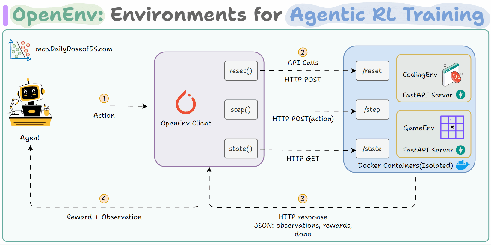

#  OpenEnv: Agentic Execution Environments

<h3 align="center" style="font-weight:normal;">
An e2e framework for building, deploying, and using isolated environments for agentic RL training with simple Gymnasium-style APIs.
</h3>

## Overview

OpenEnv standardizes interaction with agentic execution environments through simple Gymnasium-style APIs — step(), reset(), and state().  
It enables seamless integration into RL training loops while simplifying environment creation and deployment.
  
Researchers and framework developers benefit from a unified interface, while environment creators can easily build rich, isolated, and secure environments using familiar protocols (HTTP) and packaging tools (Docker).

  

